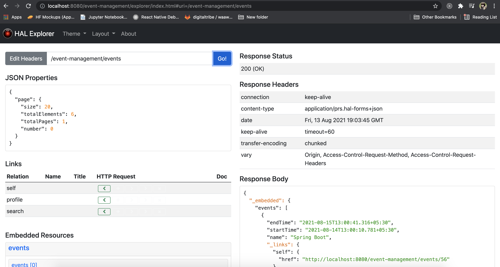
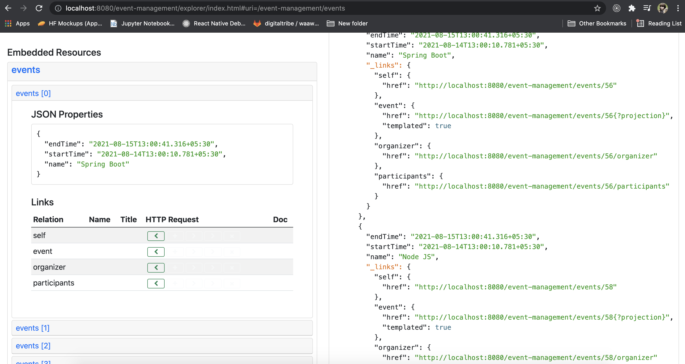
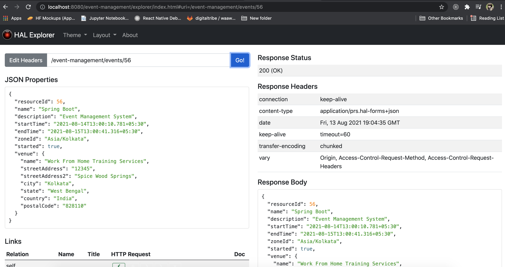
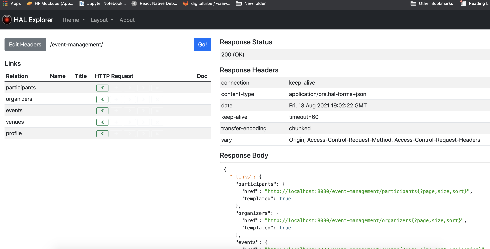

### Event Management Microservice (REST Api)

Key Entities
1. Organizer
2. Event
3. Venue
4. Participants

* java.time support
* Upgrade Hibernate version
* Add Jackson JSR310 dependency
* Use the converter

*@EntityScan (whatever classes needed at startup)

### POST 

#### Organizer
url: http://localhost:8080/event-management/organizers
Request:
```yaml {
{
    "name" : "Sumit Kr Singh"
}
```
Response:
Request:
```yaml {
{
    "created": "2021-08-13T07:25:56.008Z",
    "name": "Sumit Kr Singh",
    "_links": {
        "self": {
            "href": "http://localhost:8080/event-management/organizers/2"
        },
        "organizer": {
            "href": "http://localhost:8080/event-management/organizers/2"
        },
        "events": {
            "href": "http://localhost:8080/event-management/organizers/2/events"
        }
    }
}
```

#### Create Event with Venue
Nested Association is exposed by default as a link.
We need to customize Spring Data Rest associations in order to create Venue with Event.
We use the annotation @RestResource(exported = false) to do so.

url: http://localhost:8080/event-management/events
Request: 
```yaml {
{
    "name" : "Spring Data Rest Training",
    "description" : "Event Management System",
    "startTime" : "2021-08-13T07:30:10.781Z",
    "endTime" : "2021-08-18T07:30:41.316Z",
    "zoneId" : "Asia/Kolkata",
    "organizer" : "/organizers/1",
    "venue" : {
        "name" : "Work From Home Training Services",
        "streetAddress" : "12345",
        "streetAddress2" : "Spice Wood Springs",
        "city": "Kolkata",
        "state": "West Bengal",
        "country": "India",
        "postalCode": "828110"
    }
}
```

Response: 
```yaml {
{
    "created": "2021-08-13T07:43:47.629Z",
    "name": "Spring Data Rest Training v2",
    "description": "Event Management System v2",
    "startTime": "2021-08-14T07:30:10.781Z",
    "endTime": "2021-08-15T07:30:41.316Z",
    "zoneId": "Asia/Kolkata",
    "started": false,
    "venue": {
        "created": "2021-08-13T07:43:47.628Z",
        "name": "Work From Home Training Services v2",
        "streetAddress": "12345",
        "streetAddress2": "Spice Wood Springs",
        "city": "Kolkata",
        "state": "West Bengal",
        "country": "India",
        "postalCode": "828110"
    },
    "_links": {
        "self": {
            "href": "http://localhost:8080/event-management/events/6"
        },
        "event": {
            "href": "http://localhost:8080/event-management/events/6"
        },
        "organizer": {
            "href": "http://localhost:8080/event-management/events/6/organizer"
        },
        "participants": {
            "href": "http://localhost:8080/event-management/events/6/participants"
        }
    }
}
```
#### Create Participant
url: http://localhost:8080/event-management/participants
Request: 
```yaml {
{
    "name" : "John",
    "email" : "john@gmail.com",
    "event" : "/events/6",
    "checkedIn" : "false"
}
```

Response: 
```yaml {
{
    "created": "2021-08-13T07:48:17.202Z",
    "name": "John",
    "email": "john@gmail.com",
    "checkedIn": false,
    "_links": {
        "self": {
            "href": "http://localhost:8080/event-management/participants/8"
        },
        "participant": {
            "href": "http://localhost:8080/event-management/participants/8"
        },
        "event": {
            "href": "http://localhost:8080/event-management/participants/8/event"
        }
    }
}
```

#### Update EVENT (PUT REQUEST)
url: http://localhost:8080/event-management/events/6
Request: 
```yaml {
{
    "created": "2021-08-13T07:43:47.629Z",
    "name": "Spring Data Rest Training WFM",
    "description": "Event Management System v2",
    "startTime": "2021-08-14T07:30:10.781Z",
    "endTime": "2021-08-15T07:30:41.316Z",
    "zoneId": "Asia/Kolkata",
    "started": false,
    "venue": {
        "created": "2021-08-13T07:43:47.628Z",
        "name": "Work From Home Training Services v2",
        "streetAddress": "12345",
        "streetAddress2": "Lone Islands",
        "city": "Kolkata",
        "state": "West Bengal",
        "country": "India",
        "postalCode": "828110"
    },
    "_links": {
        "self": {
            "href": "http://localhost:8080/event-management/events/6"
        },
        "event": {
            "href": "http://localhost:8080/event-management/events/6"
        },
        "organizer": {
            "href": "http://localhost:8080/event-management/events/6/organizer"
        },
        "participants": {
            "href": "http://localhost:8080/event-management/events/6/participants"
        }
    }
}
```

Response: 
```yaml {
{
    "created": "2021-08-13T07:43:47.629Z",
    "name": "Spring Data Rest Training WFM",
    "description": "Event Management System v2",
    "startTime": "2021-08-14T07:30:10.781Z",
    "endTime": "2021-08-15T07:30:41.316Z",
    "zoneId": "Asia/Kolkata",
    "started": false,
    "venue": {
        "created": "2021-08-13T07:52:51.672Z",
        "name": "Work From Home Training Services v2",
        "streetAddress": "12345",
        "streetAddress2": "Lone Islands",
        "city": "Kolkata",
        "state": "West Bengal",
        "country": "India",
        "postalCode": "828110"
    },
    "_links": {
        "self": {
            "href": "http://localhost:8080/event-management/events/6"
        },
        "event": {
            "href": "http://localhost:8080/event-management/events/6"
        },
        "organizer": {
            "href": "http://localhost:8080/event-management/events/6/organizer"
        },
        "participants": {
            "href": "http://localhost:8080/event-management/events/6/participants"
        }
    }
}
```
#### Delete EVENT
url: http://localhost:8080/event-management/events/6


* enable paging and sorting

or set spring.data.rest.default-page-size = 5 (say)

GET EVENTS (mention page number and page size)
indexed from 0

url: http://localhost:8080/event-management/events?size=5
http://localhost:8080/event-management/events?page=1&size=5

Sort
field, asc or desc
http://localhost:8080/event-management/events?page=1&size=1&sort=id,desc
http://localhost:8080/event-management/events?page=1&size=1&sort=id,desc,sort=name,desc

### Customizing JSON

Affect order of fields
@JsonPropertyOrder({"resourceId"})
on entity class
Single field or multiple in their order


Ignore a field
@JsonIgnore on the field

Change name of a field
@JsonProperty("customName") on field

### Custom Finder Methods

Spring data is powerful and can deduce findBy queries
(by naming conventions)
spring data jpa reference for more.

Default is findOne and findAll , findById

findBy<field>

#### Example findByName (eventName)
HTTP GET METHOD

URL:
http://localhost:8080/event-management/events/search/findByName?name=Node JS
Response:
```yaml {
{
"_embedded": {
"events": [
{
"resourceId": 58,
"name": "Node JS",
"description": "Event Management System",
"startTime": "2021-08-14T13:00:10.781+05:30",
"endTime": "2021-08-15T13:00:41.316+05:30",
"zoneId": "Asia/Kolkata",
"started": false,
"venue": {
"name": "Work From Home Training Services",
"streetAddress": "12345",
"streetAddress2": "Spice Wood Springs",
"city": "Kolkata",
"state": "West Bengal",
"country": "India",
"postalCode": "828110"
},
"_links": {
"self": {
"href": "http://localhost:8080/event-management/events/58"
},
"event": {
"href": "http://localhost:8080/event-management/events/58"
},
"participants": {
"href": "http://localhost:8080/event-management/events/58/participants"
},
"organizer": {
"href": "http://localhost:8080/event-management/events/58/organizer"
}
}
},
{
"resourceId": 60,
"name": "Node JS",
"description": "Event Management System",
"startTime": "2021-08-14T13:00:10.781+05:30",
"endTime": "2021-08-15T13:00:41.316+05:30",
"zoneId": "Asia/Kolkata",
"started": false,
"venue": {
"name": "Work From Home Training Services",
"streetAddress": "12345",
"streetAddress2": "Spice Wood Springs",
"city": "Kolkata",
"state": "West Bengal",
"country": "India",
"postalCode": "828110"
},
"_links": {
"self": {
"href": "http://localhost:8080/event-management/events/60"
},
"event": {
"href": "http://localhost:8080/event-management/events/60"
},
"participants": {
"href": "http://localhost:8080/event-management/events/60/participants"
},
"organizer": {
"href": "http://localhost:8080/event-management/events/60/organizer"
}
}
},
{
"resourceId": 62,
"name": "Node JS",
"description": "Event Management System",
"startTime": "2021-08-14T13:00:10.781+05:30",
"endTime": "2021-08-15T13:00:41.316+05:30",
"zoneId": "Asia/Kolkata",
"started": false,
"venue": {
"name": "Work From Home Training Services",
"streetAddress": "12345",
"streetAddress2": "Spice Wood Springs",
"city": "Kolkata",
"state": "West Bengal",
"country": "India",
"postalCode": "828110"
},
"_links": {
"self": {
"href": "http://localhost:8080/event-management/events/62"
},
"event": {
"href": "http://localhost:8080/event-management/events/62"
},
"participants": {
"href": "http://localhost:8080/event-management/events/62/participants"
},
"organizer": {
"href": "http://localhost:8080/event-management/events/62/organizer"
}
}
}
]
},
"_links": {
"self": {
"href": "http://localhost:8080/event-management/events/search/findByName?name=Node%20JS&page=0&size=20"
}
},
"page": {
"size": 20,
"totalElements": 3,
"totalPages": 1,
"number": 0
}
}
```
http://localhost:8080/event-management/events/search/findByName?name=Spring%20Boot

To enable findBy<Field> with pagination, we change return type to
Page
URL:
http://localhost:8080/event-management/events/search/findByName?name=Node%20JS&size=1

Response:
```yaml {
{
"_embedded": {
"events": [
{
"resourceId": 58,
"name": "Node JS",
"description": "Event Management System",
"startTime": "2021-08-14T13:00:10.781+05:30",
"endTime": "2021-08-15T13:00:41.316+05:30",
"zoneId": "Asia/Kolkata",
"started": false,
"venue": {
"name": "Work From Home Training Services",
"streetAddress": "12345",
"streetAddress2": "Spice Wood Springs",
"city": "Kolkata",
"state": "West Bengal",
"country": "India",
"postalCode": "828110"
},
"_links": {
"self": {
"href": "http://localhost:8080/event-management/events/58"
},
"event": {
"href": "http://localhost:8080/event-management/events/58"
},
"participants": {
"href": "http://localhost:8080/event-management/events/58/participants"
},
"organizer": {
"href": "http://localhost:8080/event-management/events/58/organizer"
}
}
}
]
},
"_links": {
"first": {
"href": "http://localhost:8080/event-management/events/search/findByName?name=Node%20JS&page=0&size=1"
},
"self": {
"href": "http://localhost:8080/event-management/events/search/findByName?name=Node%20JS&page=0&size=1"
},
"next": {
"href": "http://localhost:8080/event-management/events/search/findByName?name=Node%20JS&page=1&size=1"
},
"last": {
"href": "http://localhost:8080/event-management/events/search/findByName?name=Node%20JS&page=2&size=1"
}
},
"page": {
"size": 1,
"totalElements": 3,
"totalPages": 3,
"number": 0
}
}
```

#### findByMultipleFields
ex-> findByNameAndZoneId

HTTP GET URL: http://localhost:8080/event-management/events/search/findByNameAndZoneId?name=Node%20JS&zoneId=Asia/Kolkata

Response:

```yaml {
{
    "_embedded": {
        "events": [
            {
                "resourceId": 58,
                "name": "Node JS",
                "description": "Event Management System",
                "startTime": "2021-08-14T13:00:10.781+05:30",
                "endTime": "2021-08-15T13:00:41.316+05:30",
                "zoneId": "Asia/Kolkata",
                "started": false,
                "venue": {
                    "name": "Work From Home Training Services",
                    "streetAddress": "12345",
                    "streetAddress2": "Spice Wood Springs",
                    "city": "Kolkata",
                    "state": "West Bengal",
                    "country": "India",
                    "postalCode": "828110"
                },
                "_links": {
                    "self": {
                        "href": "http://localhost:8080/event-management/events/58"
                    },
                    "event": {
                        "href": "http://localhost:8080/event-management/events/58"
                    },
                    "organizer": {
                        "href": "http://localhost:8080/event-management/events/58/organizer"
                    },
                    "participants": {
                        "href": "http://localhost:8080/event-management/events/58/participants"
                    }
                }
            },
            {
                "resourceId": 60,
                "name": "Node JS",
                "description": "Event Management System",
                "startTime": "2021-08-14T13:00:10.781+05:30",
                "endTime": "2021-08-15T13:00:41.316+05:30",
                "zoneId": "Asia/Kolkata",
                "started": false,
                "venue": {
                    "name": "Work From Home Training Services",
                    "streetAddress": "12345",
                    "streetAddress2": "Spice Wood Springs",
                    "city": "Kolkata",
                    "state": "West Bengal",
                    "country": "India",
                    "postalCode": "828110"
                },
                "_links": {
                    "self": {
                        "href": "http://localhost:8080/event-management/events/60"
                    },
                    "event": {
                        "href": "http://localhost:8080/event-management/events/60"
                    },
                    "organizer": {
                        "href": "http://localhost:8080/event-management/events/60/organizer"
                    },
                    "participants": {
                        "href": "http://localhost:8080/event-management/events/60/participants"
                    }
                }
            },
            {
                "resourceId": 62,
                "name": "Node JS",
                "description": "Event Management System",
                "startTime": "2021-08-14T13:00:10.781+05:30",
                "endTime": "2021-08-15T13:00:41.316+05:30",
                "zoneId": "Asia/Kolkata",
                "started": false,
                "venue": {
                    "name": "Work From Home Training Services",
                    "streetAddress": "12345",
                    "streetAddress2": "Spice Wood Springs",
                    "city": "Kolkata",
                    "state": "West Bengal",
                    "country": "India",
                    "postalCode": "828110"
                },
                "_links": {
                    "self": {
                        "href": "http://localhost:8080/event-management/events/62"
                    },
                    "event": {
                        "href": "http://localhost:8080/event-management/events/62"
                    },
                    "organizer": {
                        "href": "http://localhost:8080/event-management/events/62/organizer"
                    },
                    "participants": {
                        "href": "http://localhost:8080/event-management/events/62/participants"
                    }
                }
            }
        ]
    },
    "_links": {
        "self": {
            "href": "http://localhost:8080/event-management/events/search/findByNameAndZoneId?name=Node%20JS&zoneId=Asia/Kolkata&page=0&size=20"
        }
    },
    "page": {
        "size": 20,
        "totalElements": 3,
        "totalPages": 1,
        "number": 0
    }
}
```

Todo: given a postal code get all venues
Given an email id find the participant

* With Spring Data Rest, it is easy to expose our data domain as REST Api for CRUD operations,
but when some special logic is needed over CRUD operations, we define our custom controllers.
  
Sample Use Case

1. Organizer can start an event using event id provided event exists. If not exception is
returned.
   
2. Participant can check in if not already done. Return exception otherwise

Steps:

1. Create a Controller (@RepositoryRestController, @RequestMapping)
2. Implement class methods (@PathVariable, @RequestBody)

### HTTP POST To Start EVENT

url: http://localhost:8080/event-management/events/start/58
Response: Status (ok) 200
```yaml {
"Node JS has started!"
```

* Return ResponseEntity<JpaEntity> as a HAL object/response
  using (PersistentEntityResourceAssembler). They convert db objects into HAL resources.
  
URL: http://localhost:8080/event-management/events/checkIn/68

Response: 
``` yaml {
{
    "name": "Sam Smith",
    "email": "sam@gmail.com",
    "checkedIn": true,
    "_links": {
        "self": {
            "href": "http://localhost:8080/event-management/participants/68"
        },
        "participant": {
            "href": "http://localhost:8080/event-management/participants/68"
        },
        "event": {
            "href": "http://localhost:8080/event-management/participants/68/event"
        }
    }
}
```
Todo: Checkout if already checkedIn or else throw exception

### Projections and Excerpts

> Projections : We can send/represent a view with data that is needed by the client,
> leaving out the unnecessary ones. 
> 1. Partial Projection
> 2. Hidden Projection
> 3. Virtual Projection

> Excerpts : Projections that should be applied by default to Resource Collections.

* Steps for Projection 
1. Create a Projection Interface
2. Mark it with @Projection
3. Add getter abstract methods depending on the data we want to return

* Projections to be in same package as entities or subpackages

1. Partial Projection
  * !!! Careful even JsonIgnore fields can be exposed (hidden data) if mentioned in Projection
    interface getter method.
  > URL: 

  Response: 
  ```yaml {
{
    "_embedded": {
        "events": [
            {
                "name": "Spring Boot",
                "startTime": "2021-08-14T13:00:10.781+05:30",
                "endTime": "2021-08-15T13:00:41.316+05:30",
                "_links": {
                    "self": {
                        "href": "http://localhost:8080/event-management/events/56"
                    },
                    "event": {
                        "href": "http://localhost:8080/event-management/events/56{?projection}",
                        "templated": true
                    },
                    "participants": {
                        "href": "http://localhost:8080/event-management/events/56/participants"
                    },
                    "organizer": {
                        "href": "http://localhost:8080/event-management/events/56/organizer"
                    }
                }
            }
        ]
    },
    "_links": {
        "first": {
            "href": "http://localhost:8080/event-management/events?projection=partial&page=0&size=1"
        },
        "self": {
            "href": "http://localhost:8080/event-management/events?projection=partial&size=1"
        },
        "next": {
            "href": "http://localhost:8080/event-management/events?projection=partial&page=1&size=1"
        },
        "last": {
            "href": "http://localhost:8080/event-management/events?projection=partial&page=5&size=1"
        },
        "profile": {
            "href": "http://localhost:8080/event-management/profile/events"
        },
        "search": {
            "href": "http://localhost:8080/event-management/events/search"
        }
    },
    "page": {
        "size": 1,
        "totalElements": 6,
        "totalPages": 6,
        "number": 0
    }
}
```

2. Create virtual fields using virtual projections

Ex-> combining street addresses using spEL

HTTP GET METHOD: 
URL: http://localhost:8080/event-management/venues?projection=virtual
Response:
``` yaml {
{
    "_embedded": {
        "venues": [
            {
                "completeStreetAddress": "12345 Spice Wood Springs",
                "_links": {
                    "self": {
                        "href": "http://localhost:8080/event-management/venues/57"
                    },
                    "venue": {
                        "href": "http://localhost:8080/event-management/venues/57{?projection}",
                        "templated": true
                    }
                }
            },
            {
                "completeStreetAddress": "12345 Spice Wood Springs",
                "_links": {
                    "self": {
                        "href": "http://localhost:8080/event-management/venues/59"
                    },
                    "venue": {
                        "href": "http://localhost:8080/event-management/venues/59{?projection}",
                        "templated": true
                    }
                }
            },
            {
                "completeStreetAddress": "12345 Spice Wood Springs",
                "_links": {
                    "self": {
                        "href": "http://localhost:8080/event-management/venues/61"
                    },
                    "venue": {
                        "href": "http://localhost:8080/event-management/venues/61{?projection}",
                        "templated": true
                    }
                }
            },
            {
                "completeStreetAddress": "12345 Spice Wood Springs",
                "_links": {
                    "self": {
                        "href": "http://localhost:8080/event-management/venues/63"
                    },
                    "venue": {
                        "href": "http://localhost:8080/event-management/venues/63{?projection}",
                        "templated": true
                    }
                }
            },
            {
                "completeStreetAddress": "12345 Spice Wood Springs",
                "_links": {
                    "self": {
                        "href": "http://localhost:8080/event-management/venues/65"
                    },
                    "venue": {
                        "href": "http://localhost:8080/event-management/venues/65{?projection}",
                        "templated": true
                    }
                }
            },
            {
                "completeStreetAddress": "12345 Spice Wood Springs",
                "_links": {
                    "self": {
                        "href": "http://localhost:8080/event-management/venues/67"
                    },
                    "venue": {
                        "href": "http://localhost:8080/event-management/venues/67{?projection}",
                        "templated": true
                    }
                }
            }
        ]
    },
    "_links": {
        "self": {
            "href": "http://localhost:8080/event-management/venues?projection=virtual"
        },
        "profile": {
            "href": "http://localhost:8080/event-management/profile/venues"
        }
    },
    "page": {
        "size": 20,
        "totalElements": 6,
        "totalPages": 1,
        "number": 0
    }
}
```

Excerpt Projection: Make any projection default by adding
@RepositoryRestResource(excerpt = Projection.class)
on the Jpa Repository
URL : http://localhost:8080/event-management/events?size=1
```yaml {
{
    "_embedded": {
        "events": [
            {
                "endTime": "2021-08-15T13:00:41.316+05:30",
                "name": "Spring Boot",
                "startTime": "2021-08-14T13:00:10.781+05:30",
                "_links": {
                    "self": {
                        "href": "http://localhost:8080/event-management/events/56"
                    },
                    "event": {
                        "href": "http://localhost:8080/event-management/events/56{?projection}",
                        "templated": true
                    },
                    "participants": {
                        "href": "http://localhost:8080/event-management/events/56/participants"
                    },
                    "organizer": {
                        "href": "http://localhost:8080/event-management/events/56/organizer"
                    }
                }
            }
        ]
    },
    "_links": {
        "first": {
            "href": "http://localhost:8080/event-management/events?page=0&size=1"
        },
        "self": {
            "href": "http://localhost:8080/event-management/events?size=1"
        },
        "next": {
            "href": "http://localhost:8080/event-management/events?page=1&size=1"
        },
        "last": {
            "href": "http://localhost:8080/event-management/events?page=5&size=1"
        },
        "profile": {
            "href": "http://localhost:8080/event-management/profile/events"
        },
        "search": {
            "href": "http://localhost:8080/event-management/events/search"
        }
    },
    "page": {
        "size": 1,
        "totalElements": 6,
        "totalPages": 6,
        "number": 0
    }
}
```

Excerpt is applied on Collection of resources

### HAL Browser

HAL Browser application when pointed to Spring Data REST API can
generate JS based HAL Client on the fly.
spring-data-rest-hal-browser is the dependency.
or
spring-data-rest-hal-explorer

HAL Browser/Explorer

URL: http://localhost:8080/event-management/explorer/index.html#uri=/event-management/

> 

> 

> 

> 


### Securing Spring Microservices
1. Add Maven Dependency (spring-boot-starter-security)
2. Create Java based Config file (Configure Security Policy) that will extend WebSecurityConfigurerAdapter class
3. Define Users and roles
4. authentication and authorization

* Method Level Security
1. @EnableGlobalMethodSecurity on Java Config
2. @PreAuthorize("hasRole('ROLE_ADMIN')")

Basic Auth (username & password case sensitive)
401 Unauthorized
403 Forbidden


